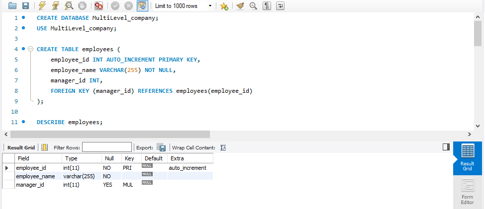
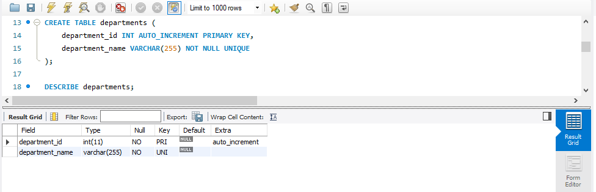
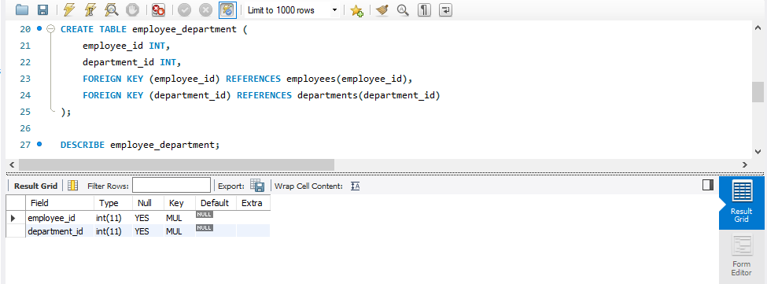
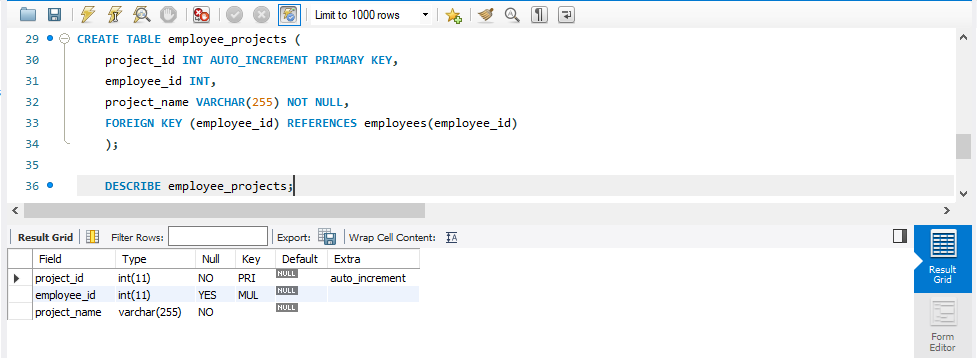
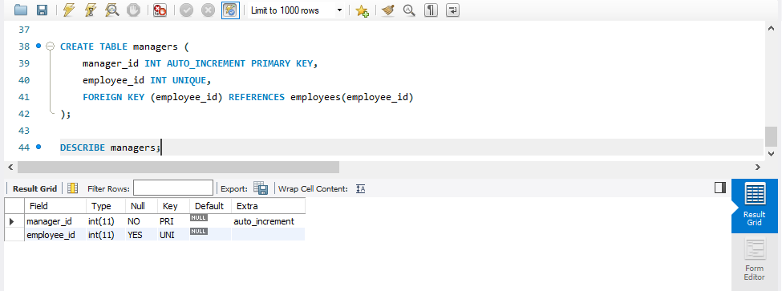
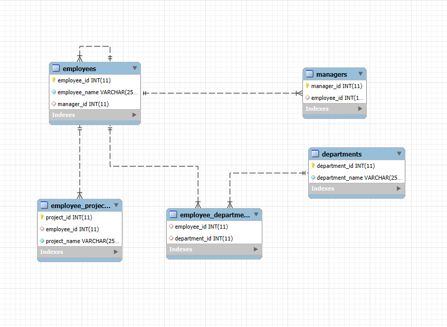

# Multi Level Company Database 
This project contains a basic relational database design for managing employee-related information in a company.
It includes employees, departments, managers, and their relationships with projects and departments.
---

## Database: MultiLevel_company

### Employees Table

This table stores employee records and their managers.
```sql
CREATE TABLE employees (
    employee_id INT(5) UNIQUE AUTO_INCREMENT PRIMARY KEY,
    employee_name VARCHAR(255) NOT NULL,
    manager_id INT,
    FOREIGN KEY (manager_id) REFERENCES employees(employee_id)
);
```
### EMPLOYEES TABLE STRUCTURE



---

### Departments Table

This table contains information about each department within the company.
```sql
CREATE TABLE departments (
    department_id INT UNIQUE AUTO_INCREMENT PRIMARY KEY,
    department_name VARCHAR(255) NOT NULL UNIQUE
);
```
### DEPARTMENTS TABLE STRUCTURE


---

### Employee_Departments Table

This table links employees to their departments, establishing many-to-many relationships.
```sql
CREATE TABLE employee_department (
    employee_id INT,
    department_id INT,
    FOREIGN KEY (employee_id) REFERENCES employees(employee_id),
    FOREIGN KEY (department_id) REFERENCES departments(department_id)
);
```
### EMPLOYEES_DEPARTMENTS TABLE STRUCTURE


---

### Task 4: Employee_Projects Table
This table keeps track of projects assigned to each employee.
```sql
CREATE TABLE employee_projects (
    employee_id INT,
    project_name VARCHAR(255) NOT NULL,
    FOREIGN KEY (employee_id) REFERENCES employees(employee_id)
);
```
### EMPLOYEES_PROJECTS TABLE STRUCTURE


---

### Task 5: Managers Table
This table stores manager information, linking them back to employee records.
```sql
CREATE TABLE managers (
    manager_id INT UNIQUE AUTO_INCREMENT PRIMARY KEY,
    employee_id INT UNIQUE,
    FOREIGN KEY (employee_id) REFERENCES employees(employee_id)
);
```
### MANAGERS TABLE STRUCTURE


### EER Diagram
This diagram shows a visual representation of the relationships among the tables.

