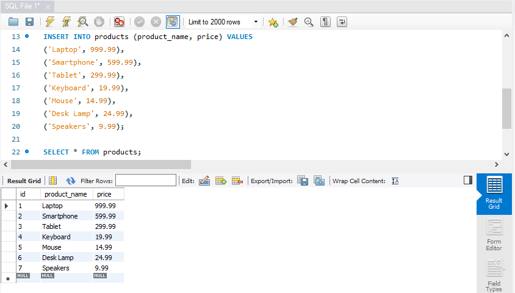

# Finals Lab Task 3. Table Manipulation
This task involves creating and managing a product database using MySQL. You are required to follow a step-by-step approach to perform operations such as table creation, data insertion, and schema modification.

## Here’s the Query Statements

Fisrt, a command that create a database, so subsequent SQL operations will be performed within that specific database.
```sql
CREATE DATABASE products;
USE products;
```

### TASK 1
```sql
CREATE TABLE products (
    id INT AUTO_INCREMENT PRIMARY KEY,
    product_name VARCHAR(100) NOT NULL,
    price DECIMAL(10, 2)
);
```
### TASK 2
```sql
ALTER TABLE products
ADD CONSTRAINT chk_price CHECK (price > 0);
```

### TASK 3
```sql
INSERT INTO products (product_name, price) VALUES
('Laptop', 999.99),
('Smartphone', 599.99),
('Tablet', 299.99),
('Keyboard', 19.99),
('Mouse', 14.99),
('Desk Lamp', 24.99),
('Speakers', 9.99);
```

### TASK 4
```sql
ALTER TABLE products
MODIFY product_name VARCHAR(120) NOT NULL;
```
This command is used in MySQL Workbench to display the structure of the table, showing details about each column such as its name, data type, whether it allows NULL values, if it's a key, its default value, and any extra attributes.
```sql
DESCRIBE products;
```


### Product Table

Here's the screenshot of the whole Query Statements and Table Structure (See screenshots)
 


### Product's Value Table

Here's the screenshot of the Query Statements and Table Structure (See screenshots)
 

