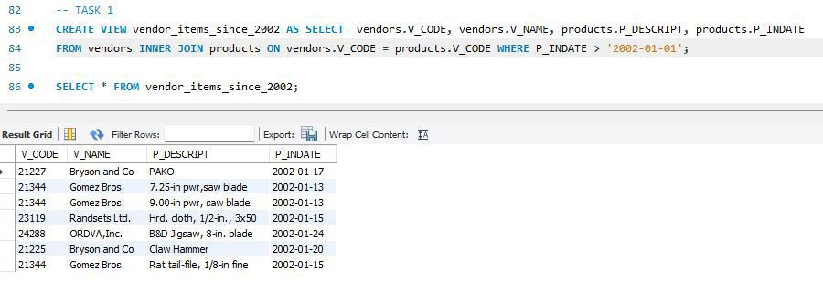

# Final Lab Task 5: Using SQL Views and Stored Procedures and Stored Functions
For this task, we are given initial query creates reusable views, procedures, and functions to simplify querying and updating product and vendor data in the inventory database.

## Here's the screenshot of the whole Query Statements and Table Structure (See screenshots)

### TASK 1

### TASK 2

### TASK 3

### TASK 4

### TASK 5

