# Final Lab Task 6: MongoDB Practice

## Here’s the Query Statements

```sql
use mongo_practice
```
### Create Database


### Insert Documents

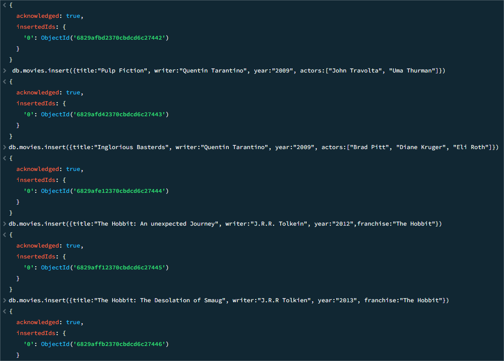

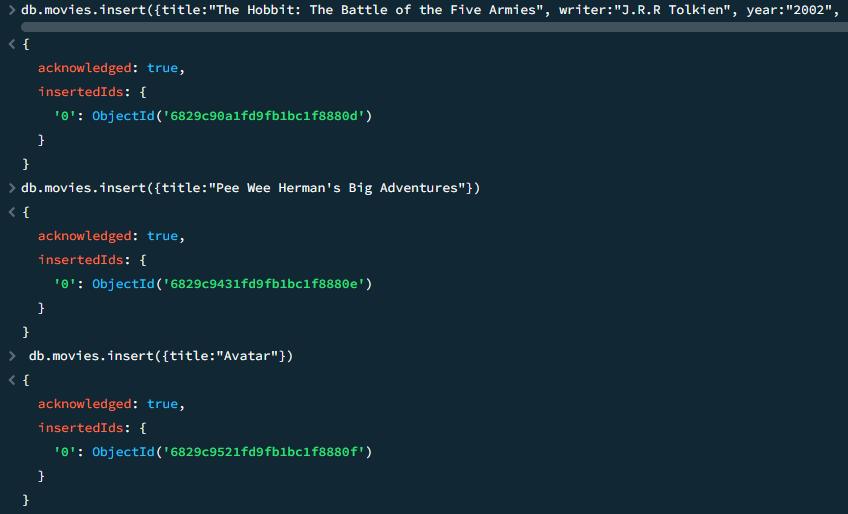

### Query Find
```sql
db.movies.find()
```
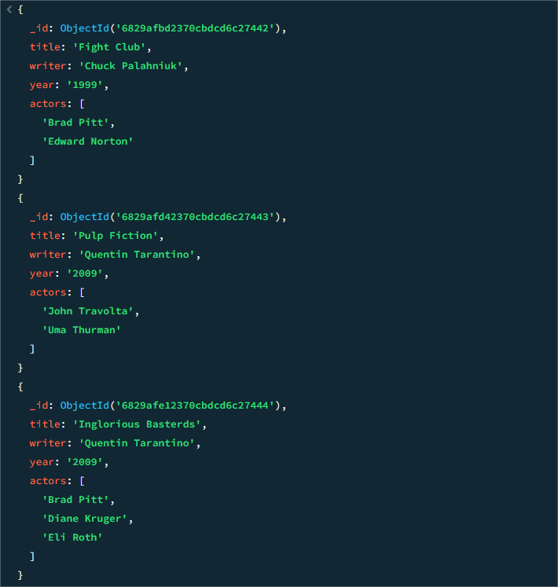

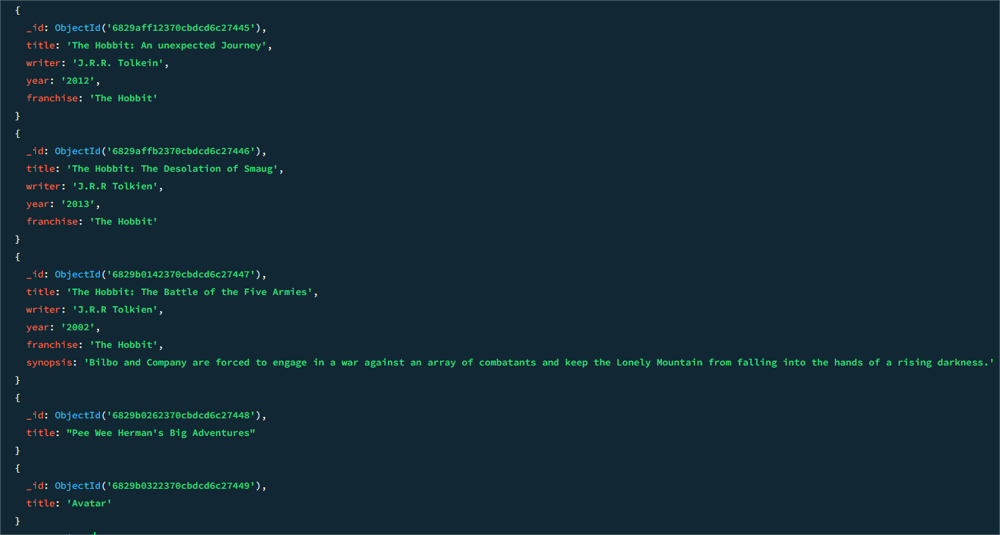

```sql
db.movies.find({writer:”Quentin Tarantino”})
```
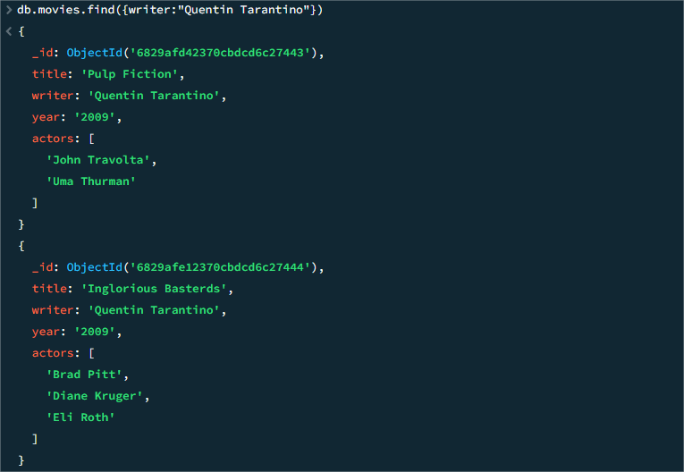

```sql
db.movies.find({actors:”Brad Pitt”})
```
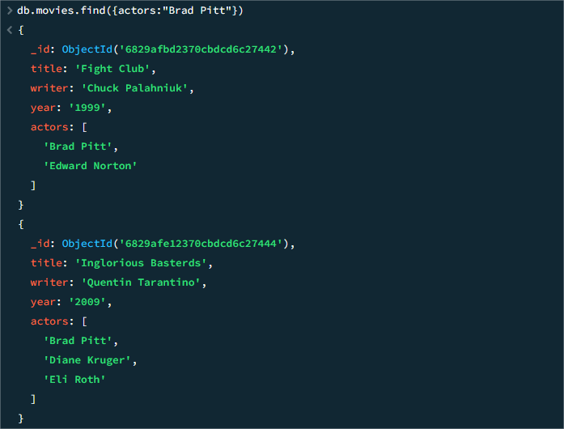

```sql
db.movies.find({franchise:”The Hobbit”})
```
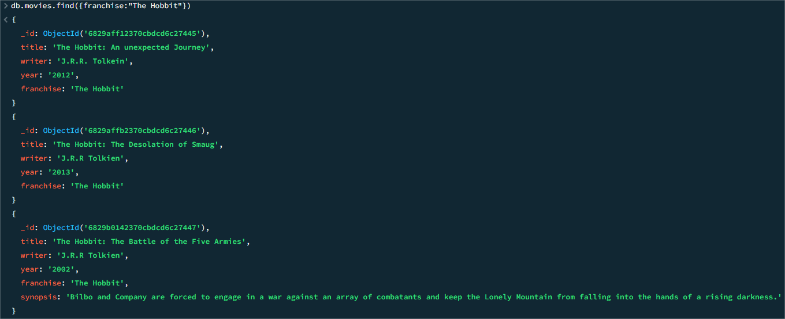

```sql
db.movies.find({year:{$gt:”1990”, $lt:”2000”}})
```
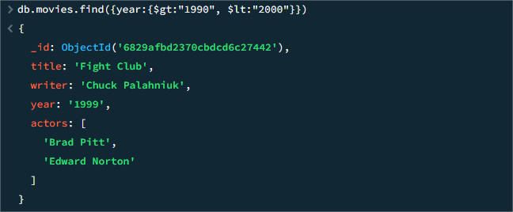

```sql
db.movies.find({$or:[{year:{$gt:”2010”}},{year: {$lt:”2000”}}]})
```
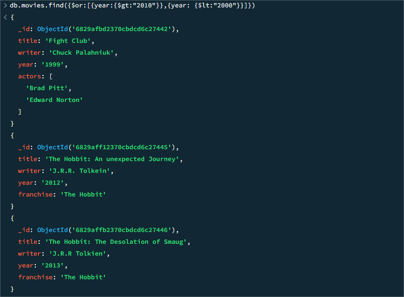

### Update Documents

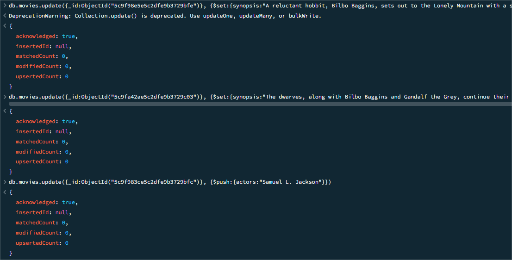

### Text Search

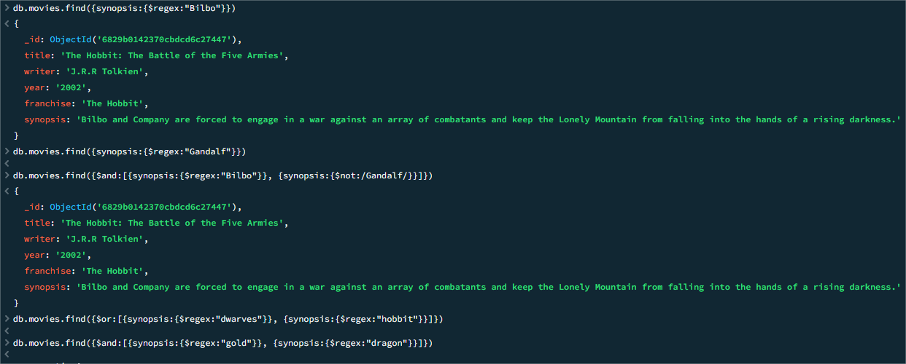

### Delete Documents

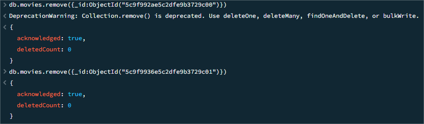

