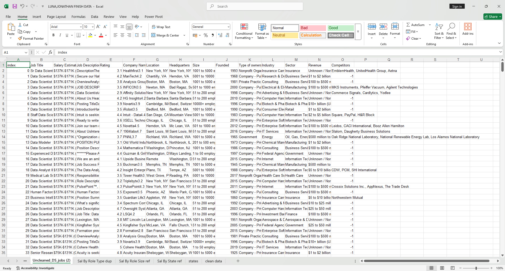
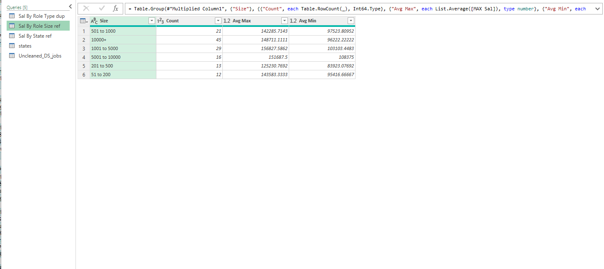
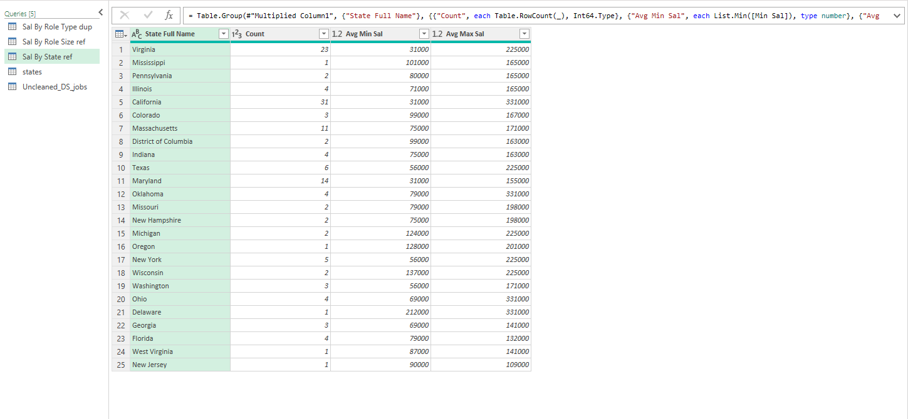
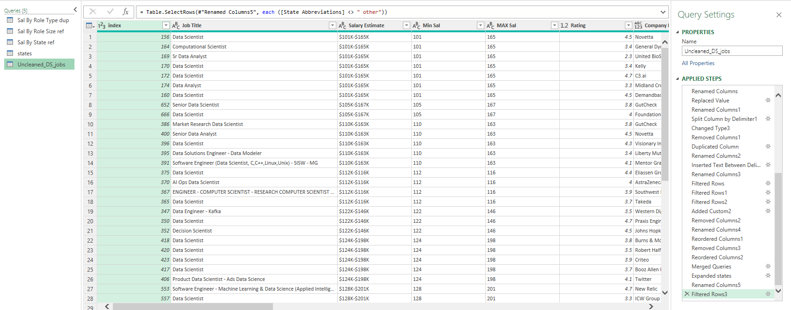
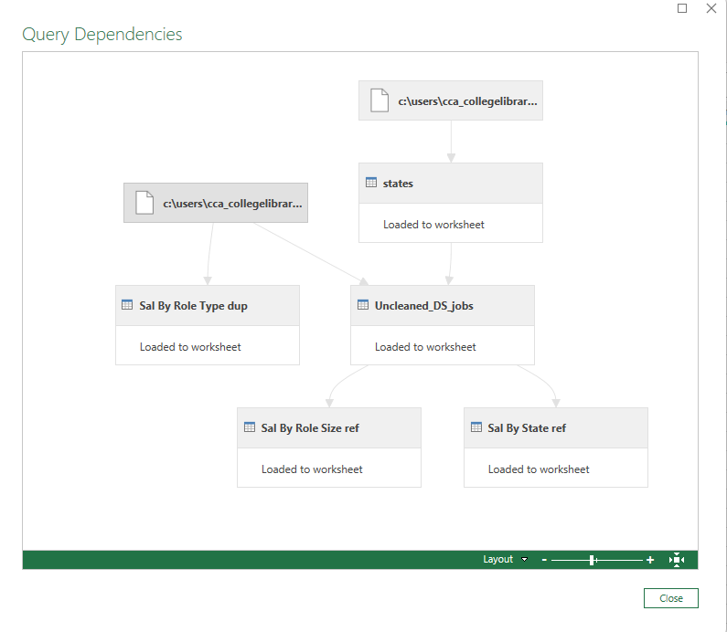

## Midterm Lab Task 2 – Data Cleaning and Transformation Using Power Query Editor

## Task Overview:
The objective of this task is to clean and transform a raw dataset of job postings, provided in the "Uncleaned_DS_jobs.csv" file, using Power Query Editor in Excel. Company X is interested in extracting insights that answer the following questions:

Which job roles pay the highest and the lowest?
What size companies pay the best?
Where do specific job roles or job titles pay the best and the least in a particular state?
## Instructions:

### Download the Dataset:

Download the "Uncleaned_DS_jobs.csv" file from Kaggle or the relevant source.
### Load the Data into Excel:

Open Excel, navigate to Data → New Query → From File → From Text/CSV.
Select the "Uncleaned_DS_jobs.csv" and load it.
### Edit the Dataset using Power Query Editor:

Duplicate the raw data for backup.
Clean and transform the data to answer the above questions.
## 2. Screenshot of the Dataset Before Cleaning and Transformation

### Screenshot Description:
The raw dataset consists of several columns, such as job title, company size, salary estimates, location, etc. These columns are often uncleaned, containing extra spaces, special characters, inconsistent values, and more, which need to be cleaned and transformed before analysis.

## 3. Steps Performed in Data Cleaning and Transformation
Step-by-step Data Cleaning and Transformation using Power Query Editor:

#### Clean the "Salary Estimate" Column:

Go to Transform Menu → Extract → Text Before Delimiter → Enter the delimiter "(" to clean the salaries by removing the characters after the opening parentheses.
Create Two New Columns for Salary (Min Salary and Max Salary):

#### Min Sal Column:
Use Add Column → Column from Examples → Provide an example (e.g., 101) for the first value in the "Salary Estimate".
Rename the new column to "Min Sal".
#### Max Sal Column:
Follow the same process to create a "Max Sal" column.
Add Role Type Column:

#### Create a Custom Column to group job titles into predefined categories (e.g., "Data Scientist", "Data Analyst", etc.)
Split the Location Column:

#### Custom Columns for handling special cases (e.g., New Jersey, Remote, United States).
Use Split Column by Delimiter for locations.
Rename the new columns to "State Abbreviations" and clean any outliers in location data (e.g., “Anne Rundell”).
Handle Company Size:

#### Split the "Company Size" column into MinCompanySize and MaxCompanySize columns.
Handle Negative Values and Missing Data:

#### Filter out rows with negative values in "Competitors" and "Industry" columns, and filter out zero values in "Revenues".
Remove Unnecessary Columns:

#### Remove columns such as descriptions and any unneeded metadata.
Proof of Data Cleaning:

Copy and paste the applied steps from the Power Query Editor for documentation.

## 4. Final Output (Screenshot of the Final Queries)

## Dependencies and References of the QUERIES

### Final Queries:
The final queries should consist of the following cleaned and transformed datasets:

### Sal by Role Type (Duplicate):

Data grouped by job roles, showing the average minimum and maximum salaries per role.
### Sal by Size (Reference):

Data grouped by company size, showing the average minimum and maximum salaries for each company size.
### Sal by State (Reference):

Data grouped by state, showing the average minimum and maximum salaries per state.
### Uncleaned DS Jobs:

The raw data that was cleaned and transformed, with all unnecessary columns removed.
